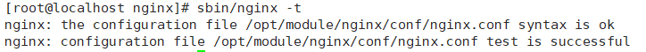

##### 1. 下载安装

1. 下载地址：http://nginx.org/en/download.html

2. Linux系统下安装

   - 解压tar包

     ~~~shell
     tar -xzvf nginx-1.18.0.tar.gz
     ~~~

   - 配置安装路径

     ~~~shell
     # 进入解压后目录
     cd nginx-1.18.0
     # 配置安装路径
     ./configure --prefix=/opt/module/nginx
     ~~~

   - 编译安装

     ~~~shell
     make
     make install
     ~~~

   - 测试nginx安装情况

     ~~~shell
     # 进入安装路径
     cd /opt/module/nginx/
     
     # 测试安装情况
     sbin/nginx -t
     
     # 指定配置文件
     sbin/nginx -t -c /opt/module/nginx/conf/nginx.conf
     ~~~

     

   - 启动nginx

     ~~~shell
     # 进入安装路径
     cd /opt/module/nginx/
     
     # 启动
     sbin/nginx
     ~~~

   - 停止/重启nginx

     ~~~shell
     # 停止
     sbin/nginx -s stop
     
     # 重启
     sbin/nginx -t -c /opt/module/nginx/conf/nginx.conf
     ~~~

     

