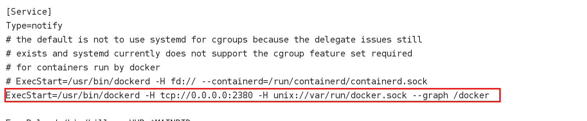

##### 1. 安装

~~~shell
# step 1: 安装必要的一些系统工具
yum install -y yum-utils device-mapper-persistent-data lvm2
# Step 2: 添加软件源信息
yum-config-manager --add-repo http://mirrors.aliyun.com/docker-ce/linux/centos/docker-ce.repo
# Step 3: 更新并安装 Docker-CE
yum makecache fast
yum -y install docker-ce
# Step 4: 开启Docker服务
service docker start
~~~

##### 2.自定义配置

~~~shell
vim /usr/lib/systemd/system/docker.service
# 开启远程访问
ExecStart=/usr/bin/dockerd -H tcp://0.0.0.0:2380
# 修改主目录
ExecStart=/usr/bin/dockerd -H tcp://0.0.0.0:2380 -H unix://var/run/docker.sock --graph /docker
~~~

##### 3.常用命令

~~~shell
# 拉取镜像
docker pull imageName[:version]
# docker pull redis:5.0.5

# 构建自定义镜像
docker build -t imageName[:version] 路径
# docker build -t manage:1.0 .

# 运行容器
docker run -di --name manage --restart=always -p 10000:10000 -v /data/springBoot/manage/uploadPath:/data/manage/uploadPath 镜像ID/镜像名称/镜像名称:版本号
## --name 指定容器名称
## --restart 跟随Docker自启
## -p 端口映射：宿主主机端口：容器端口
## -v 文件映射：宿主主机路径：容器路径

# 进入容器
docker exec -it 容器名称 bash
# docker exec -it manage bash

# 查看镜像列表
docker images

# 删除镜像
docker rmi 镜像名称/镜像名称:版本号/镜像ID

# 查看运行中容器
docker ps
# 查看全部容器
docker ps -a
#启动/停止/重启容器
docker start/stop/restart 容器名称/容器ID
# 删除容器
docker rm 容器名称/容器ID
# 查看容器日志
docker logs 容器名称/容器ID
# 查看容器动态日志
docker logs -f 容器名称/容器ID
~~~

##### 4.DockerFile

用于构建自定义镜像

~~~shell
# DockerFile样例

# 依赖其他镜像
FROM kdvolder/jdk8

# 作者签名
 MAINTAINER LemonZuo

# 简化 jar 的名字路径
 COPY ruoyi-admin.jar /app.jar

# 执行 java -jar 命令 （CMD：在启动容器时才执行此行。RUN：构建镜像时就执行此行）
 CMD java -jar /app.jar

# 设置对外端口为 10000
 EXPOSE 10000
~~~

