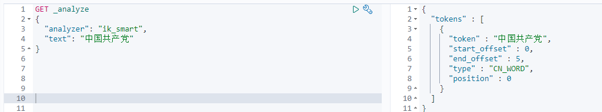
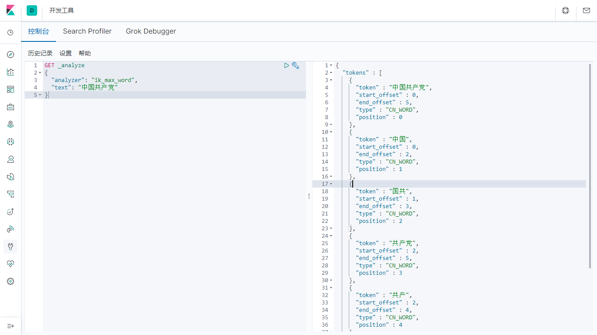
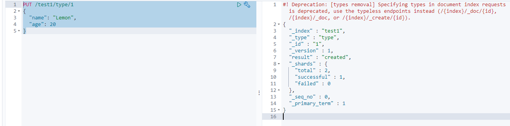
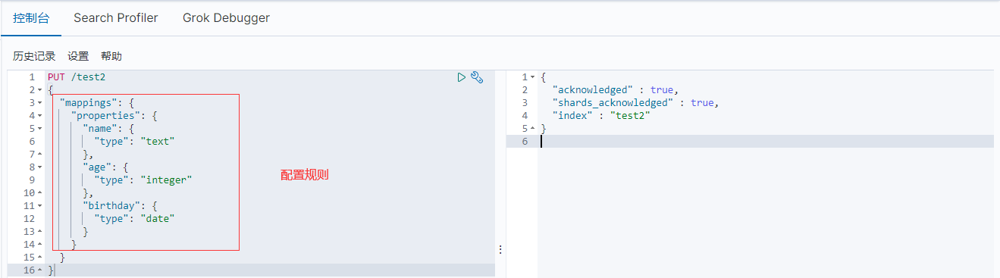

#  Elasticsearch 下载安装

> 官网地址：https://www.elastic.co/cn/elasticsearch
>
> 下载地址：https://www.elastic.co/cn/downloads/elasticsearch

# kibana下载安装

> 官网地址：https://www.elastic.co/cn/kibana
>
> 下载地址：https://www.elastic.co/cn/downloads/kibana

# ES核心概念

> Elasticsearch是面向文档，一切皆JSON

| 关系型数据库     | ES            |
| ---------------- | ------------- |
| 数据库(database) | 索引(indices) |
| 表(table)        | types         |
| 行(row)          | documents     |
| 字段(colum)      | fields        |

# IK分词器

> 中文分词器

1. 下载地址：https://github.com/medcl/elasticsearch-analysis-ik
2. 下载完毕后放入Elasticsearch插件中(安装目录下/plugins)即可

> 分词模式

1. ik_smart：最少切分
2. ik_max_word：最细颗粒度划分（穷尽词库）

> 查看不同分词器分词效果

ik_smart

ik_max_word

> IK分词器增加自定义词典

1. ik分词器安装目录/config新增***.dic

2. ***.dic中新增内容按行分隔

3. 配置IKAnalyzer.cfg.xml

   ~~~xml
   <?xml version="1.0" encoding="UTF-8"?>
   <!DOCTYPE properties SYSTEM "http://java.sun.com/dtd/properties.dtd">
   <properties>
   	<comment>IK Analyzer 扩展配置</comment>
   	<!--用户可以在这里配置自己的扩展字典 -->
   	<entry key="ext_dict">kuang.dic</entry>
   	 <!--用户可以在这里配置自己的扩展停止词字典-->
   	<entry key="ext_stopwords"></entry>
   	<!--用户可以在这里配置远程扩展字典 -->
   	<!-- <entry key="remote_ext_dict">words_location</entry> -->
   	<!--用户可以在这里配置远程扩展停止词字典-->
   	<!-- <entry key="remote_ext_stopwords">words_location</entry> -->
   </properties>
   ~~~

# Rest风格说明

> 基本Rest命名说明

| method | url                                             | 描述                   |
| ------ | ----------------------------------------------- | ---------------------- |
| PUT    | 127.0.0.1:9200/索引名称/类型名称/文档ID         | 创建文档并指定文档ID   |
| POST   | 127.0.0.1:9200/索引名称/类型名称                | 创建文档随机生成文档ID |
| POST   | 127.0.0.1:9200/索引名称/类型名称/文档ID/_update | 修改文档               |
| DELETE | 127.0.0.1:9200/索引名称/类型名称/文档ID         | 删除文档               |
| GET    | 127.0.0.1:9200/索引名称/类型名称/文档ID         | 通过文档ID查询文档     |
| POST   | 127.0.0.1:9200/索引名称/类型名称/_search        | 查询所有数据           |

> 基础测试

1. 创建索引

   ~~~txt
   PUT /test1/type/1 
   {
     "name": "Lemon",
     "age": 20
   }
   ~~~

   

2. 创建索引并指定字段数据类型

   ~~~json
   PUT /test2
   {
     "mappings": {
       "properties": {
         "name": {
           "type": "text"
         },
         "age": {
           "type": "integer"
         },
         "birthday": {
           "type": "date"
         }
       }
     }
   }
   ~~~

   

3. 获取索引具体信息

    

4. 查看默认信息

    

> 若文档字段没有指定，ES会自动配置默认字段数据类型

5. 扩展：通过命令elasticsearch索引情况

~~~html
<!-- 查看集群健康状态 -->
GET _cat/health
<!-- 查看索引 -->
GET _cat/indices
~~~

> 修改(旧) 提交还是使用PUT即可, 版本号会递增

> 修改(新)

6. 删除文档

    ~~~json
    DELETE /test3/_doc/1
    ~~~

    

7. 删除索引

    ~~~json
    DELETE /test3
    ~~~

    

# 关于文档基本操作(重点)

## 基本操作

1. 添加数据

    ~~~json
    PUT /index_data/_doc/1
    {
      "name": "Lemon",
      "age": 22,
      "des": "LemonZuo",
      "tags": [
        "Java",
        "Vue",
        "SpringBoot"
      ]
    }
    ~~~

2. 查看数据

    

3. 更新数据

    

4. 条件搜索

    ~~~json
    GET /index_data/_doc/_search?q=name:"李四"
    ~~~

    

## 复杂操作

> 查看索引下全部数据

~~~json
GET index_data/_search?pretty
~~~

**hits: 索引和文档的信息（结果总数，最高匹配率等信息）**

> 模糊查询

~~~json
GET /index_data/_doc/_search
{
  "query": {
    "match": {
      "name": "Lemon"
    }
  }
}
~~~

> 指定结果列

~~~json
GET /index_data/_doc/_search
{
  "query": {
    "match": {
      "name": "Lemon"
    }
  },
  ## 指定结果列  
  "_source": ["name", "des"]
}
~~~

> 排序

~~~json
GET /index_data/_doc/_search
{
  "sort": [
    {
      "age": {
        "order": "desc"
      }
    }
  ]
}
~~~

> 分页查询

~~~json
GET /index_data/_doc/_search
{
  "sort": [
    {
      "age": {
        "order": "desc"
      }
    }
  ],
  ## 分页参数
  "from": 0,
  "size": 2
}
~~~

> 布尔查询

> must===>(Mysql:AND)

~~~json
GET /index_data/_doc/_search
{
  "query": {
    "bool": {
      "must":[{
        "match": {
          "name": "Lemon"
        }
      },
      {
        "match": {
          "age": "22"
        }
      }]
    }
  }
}
~~~

> should ===>(Mysql:OR)

~~~json
GET /index_data/_doc/_search
{
  "query": {
    "bool": {
      "should":[{
        "match": {
          "name": "Lemon"
        }
      },
      {
        "match": {
          "age": "18"
        }
      }]
    }
  }
}
~~~

> 不等于 must_not ===> (Mysql: !=/<>)

~~~json
GET /index_data/_doc/_search
{
  "query": {
    "bool": {
      "must_not":[{
        "match": {
          "name": "Lemon"
        }
      },
      {
        "match": {
          "age": "18"
        }
      }]
    }
  }
}
~~~

> 过滤器

~~~json
GET /index_data/_doc/_search
{
  "query": {
    "bool": {
      "must":[{
        "match": {
          "age": 18
        }
      }],
      "filter": {
        "range": {
          "age": {
            "gt": 10
          }
        }
      }
    }
  }
}

####
gt: >
gte: >=
lt: <
lte: <=
~~~

> 同一字段多条件查询

~~~json
GET index_data/_doc/_search
{
  "query": {
    "match": {
      "tags": "违 犯"
    }
  }
}
~~~

> 精确查询

term查询直接通过倒排索引指定的词条进行精确查找

关于分词：

- trem，直接查询精确的

- match: 会使用分词器解析

**两个类型**

- text

- keyword

结果

> 多条件精确查询

~~~json
GET db_test/_search
{
  "query": {
    "bool": {
      "should": [
        {
          "term": {
            "t1": "11"
          }
        },
        {
          "term": {
            "t1": "22"
          }
        }
      ]
    }
  }
}
~~~

> 高亮查询

~~~json
GET db_index/_search
{
  "query": {
    "match": {
      "name": "法"
    }
  },
  "highlight": {
    "fields": {
      "name": {}
    }
  }
}
~~~

> 自定义高亮前缀后缀

~~~json
GET db_index/_search
{
  "query": {
    "match": {
      "name": "法"
    }
  },
  "highlight": {
    "pre_tags": "
", 
    "post_tags": "
", 
    "fields": {
      "name": {}
    }
  }
}
~~~

# 整合SpringBoot

> 官方文档：https://www.elastic.co/guide/index.html

- pom依赖

    ~~~xml
    <dependency>
        <groupId>org.elasticsearch.client</groupId>
        <artifactId>elasticsearch-rest-high-level-client</artifactId>
        <version>7.6.2</version>
    </dependency>
    
    <dependency>
        <groupId>org.springframework.boot</groupId>
        <artifactId>spring-boot-starter-data-elasticsearch</artifactId>
    </dependency>
    ~~~

    

- 初始化

    ~~~java
    // 初始化客户端
    RestHighLevelClient client = new RestHighLevelClient(
            RestClient.builder(
                    new HttpHost("localhost", 9200, "http"),
                    new HttpHost("localhost", 9201, "http")));
    // 关闭客户端
    client.close();
    ~~~

> 创建索引

~~~java
// 创建索引请求
CreateIndexRequest request = new CreateIndexRequest(str);
// 客户端执行请求，获得响应
CreateIndexResponse response = client.indices().create(request, RequestOptions.DEFAULT);
log.info("{}", response);
~~~

